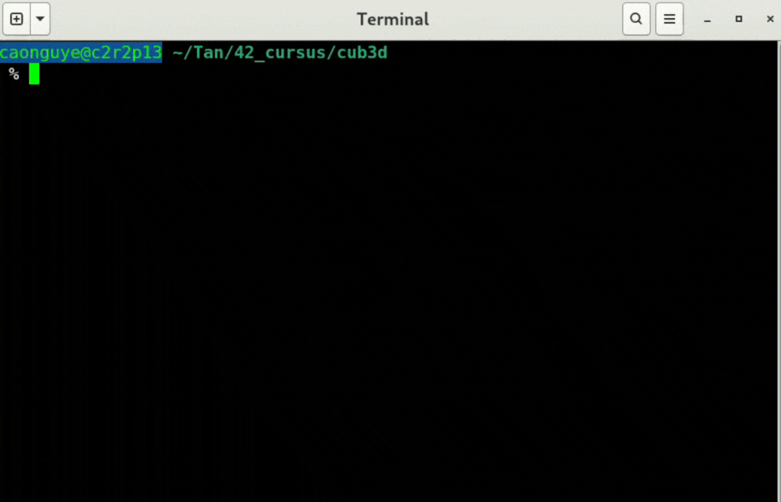

# 🕹️ Cub3D - 42 School Project

> Step into the world of early 90s gaming with **Cub3D** — a 3D graphical raycasting engine inspired by Wolfenstein 3D. Built from scratch using MiniLibX, this project transforms flat map files into immersive first-person experiences.

## ✍️ Authors

- **Cao Tan** – Parsing & Map logic ([GitHub](https://github.com/Siuol7))
- **Triet Pham** – Raycasting & Rendering ([GitHub](https://github.com/hihi-louis))
- **Uyen Tran** - Sprite editor

## 🎯 Overview

Cub3D is more than a game—it's a dive into the graphics pipeline, player movement, and raycasting mechanics. Load a `.cub` file, render a world, and explore in first person. With texture mapping, wall collisions, and sprite rendering, it’s a celebration of low-level graphics programming.

## 🌟 Core Features

- 🗺️ **.cub map parsing** with validation and error handling
- 🧭 **WASD movement** and smooth camera rotation
- 🧱 **Raycasting** with DDA to detect walls & objects
- 🎨 **Texture-mapped walls** for immersive scenes
- 🚪 **Sprite rendering** with depth-aware sorting
- 📐 **MiniMap (bonus)** for tactical overview
- 🔊 **Optional sounds** (bonus)

## 🔍 Behind the Scenes

1. **Map Parsing**:
   - Normalize map layout
   - Detect errors (holes, invalid chars, multiple spawns)
   - Extract textures, colors, and player info
   - 
3. **Input Handling**:
   - Move player smoothly by WASD
   - Rotate camera with arrow keys and mouses 
   - Handle exit and edge cases by ESC and X button
     
2. **Raycasting Engine**:
   - Cast rays from player's POV
   - Step through grid with DDA
   - Detect wall hits and calculate distances
   - Render vertical slices with texture mapping

4. **Rendering**:
   - Draw ceiling, floor, and textured walls
   - Manage double-buffering to prevent flicker
   - Handle sprite ordering and occlusion (bonus)
  
5. **Displaying**:
   - Display to windows

## 🎓 Lessons Learned

1. Raycasting & Vector math
2. Event-driven programming
3. Texture mapping & DDA
4. Memory and resource management (MLX lifecycle)

## 📦 Installation & Launch

```bash
# Clone the retro adventure
git clone https://github.com/42VN-Pasila/42-Cub3d cub3d
cd cub3d
make         # build the game

# Run the game with a map
./cub3D maps/template.cub
```

| ***Execute & Makefile tutorial*** | ***Playing Cub3d moving and stabbing*** |
|-----------|--------------|
|  |  |
